<div align="center">

# 📍 MitaAn

### Plateforme locale de services et de vente avec géolocalisation

**Connectez-vous à votre communauté. Trouvez tout près de vous.**

[](https://flutter.dev)
[](https://firebase.google.com)
[](https://dart.dev)
[](https://play.google.com)
[](LICENSE)

[Problématique](#-problématique) • [Solution](#-notre-solution) • [Architecture](#-architecture) • [Fonctionnalités](#-fonctionnalités) • [Captures d'écran](#-captures-décran) • [Installation](#-installation) • [Équipe](#-équipe)

---

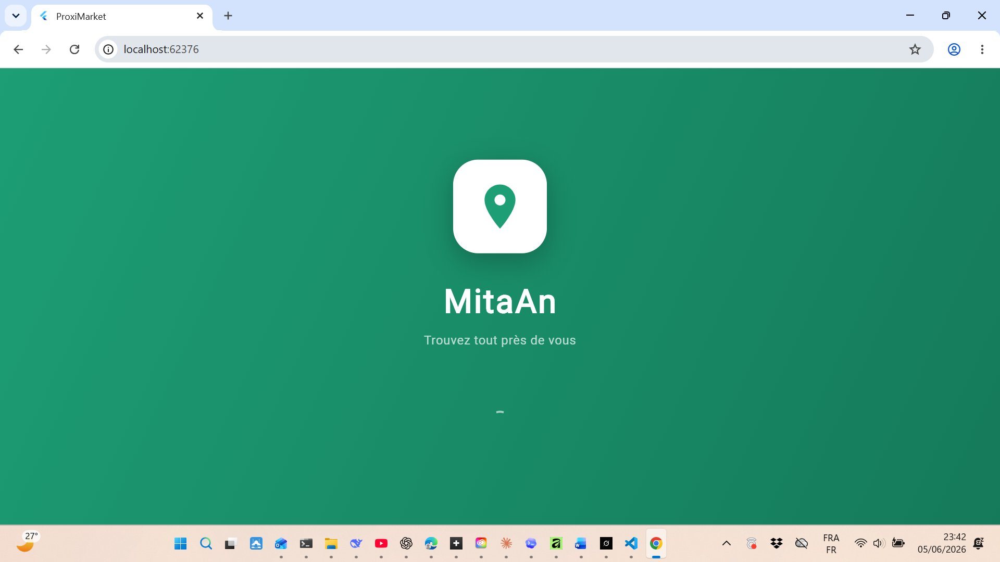

*Cible initiale : Côte d'Ivoire, Mali, Sénégal, Burkina Faso & pays voisins*

</div>

---

## 🔴 Problématique

### Le commerce local africain est déconnecté du numérique

L'Afrique de l'Ouest vit une transformation numérique rapide, mais les professionnels locaux restent invisibles en ligne :

- **80% des artisans et prestataires** n'ont aucune présence numérique
- Les clients perdent du temps à chercher des prestataires **bouche-à-oreille**
- Les outils existants (Facebook, Instagram) ne sont **pas adaptés** à la mise en relation locale de proximité
- Les plateformes occidentales (Airbnb, TaskRabbit) sont **inaccessibles** ou **inadaptées** au contexte africain

### Le coût de l'absence de mise en relation numérique

Un plombier qualifié à 2 km reste invisible pour un client qui en cherche un désespérément. Un artisan exceptionnel ne dépasse jamais son quartier. Un client paye 3× plus cher pour un service disponible à côté de chez lui — faute de le trouver.

**Le problème n'est pas l'absence de talent — c'est l'absence de visibilité et de connexion.**

---

## 💡 Notre Solution

### MitaAn : La plateforme de mise en relation locale par GPS

MitaAn connecte **professionnels locaux et clients** grâce à la géolocalisation en temps réel. En quelques secondes, un client trouve les prestataires disponibles près de lui, voit leurs annonces, et les contacte directement.

| Composant | Technologie | Rôle |
|-----------|-------------|------|
| 📱 **Application mobile** | Flutter 3.41.9 (Android) | Interface utilisateur cross-plateforme |
| 🗄️ **Base de données** | Firebase Firestore | Données temps réel, offline-first |
| 🔐 **Authentification** | Firebase Auth + Google | Inscription email et connexion sociale |
| 🗺️ **Géolocalisation** | Geolocator + flutter_map + OSM | Carte interactive sans API payante |
| 🖼️ **Stockage images** | Cloudinary (gratuit) | Upload photos sans carte bancaire |
| 🔔 **Notifications push** | Firebase Cloud Messaging | Alertes messages en temps réel |
| 💬 **Messagerie** | Firestore + Provider | Chat intégré client ↔ prestataire |
| ⭐ **Système d'avis** | Firestore Reviews | Notation et commentaires vérifiés |

### Ce qui nous différencie

- **100% gratuit à lancer** — Aucun abonnement, aucune carte bancaire (Cloudinary + Firebase free tier + OpenStreetMap)
- **Offline-first** — Fonctionne même sans connexion grâce au cache Firestore
- **Adapté à l'Afrique** — Indicatifs téléphoniques africains, FCFA, WhatsApp intégré, interface en français
- **Contact direct** — Appel téléphonique + WhatsApp + messagerie interne depuis l'annonce
- **Géolocalisation précise** — Distance à vol d'oiseau, filtre par rayon (1–50 km), carte OpenStreetMap

---

## 🏗️ Architecture

### Vue d'ensemble

```
┌─────────────────────────────────────────────────────────────────┐
│                          MITAAN                                 │
│             Plateforme locale de services par GPS               │
├──────────────┬──────────────┬──────────────┬───────────────────┤
│   AUTH       │   DONNÉES    │   MÉDIA      │   COMMUNICATION   │
│              │              │              │                   │
│ Firebase Auth│  Firestore   │  Cloudinary  │  FCM Push Notif.  │
│ (Email+Google│  (NoSQL RT)  │  (Images)    │  Chat Firestore   │
│              │              │              │                   │
│ JWT Tokens   │  Offline     │  Multi-photo │  WhatsApp Deep    │
│ Google OAuth │  Persistence │  Compression │  Link + Appel     │
├──────────────┴──────────────┴──────────────┴───────────────────┤
│                     State Management (Provider)                 │
├────────────────────────────────────────────────────────────────┤
│                    UI Flutter (Android)                         │
│         Géolocalisation GPS + Carte OpenStreetMap              │
└────────────────────────────────────────────────────────────────┘
```

### Flux de données

```
Utilisateur → Inscription/Connexion → Profil + GPS
                                           │
                              ┌────────────┼────────────┐
                              ▼            ▼            ▼
                         Publier       Chercher     Contacter
                         Annonce       Services     Prestataire
                              │            │            │
                    ┌─────────┘    ┌───────┘    ┌──────┘
                    ▼              ▼            ▼
               Firestore      Filtre GPS    Chat / WhatsApp
               + Cloudinary   + Catégorie   / Appel direct
               (Photos)       + Distance    
```

### Structure du projet

```
lib/
├── core/                    # Constantes globales (AppConstants)
├── models/                  # UserModel, ServiceModel, MessageModel
├── providers/               # AuthProvider, ServiceProvider, CategoryProvider
├── services/                # Auth, Firestore, Chat, Location, Notification...
├── screens/
│   ├── auth/                # Connexion, Inscription
│   ├── home/                # HomeScreen, ServicesListScreen
│   ├── map/                 # MapScreen (flutter_map + OSM)
│   ├── services/            # Créer, Modifier, Détail, Mes annonces
│   ├── profile/             # Profil, Favoris, Profil public
│   ├── chat/                # ChatScreen, ChatListScreen
│   ├── reviews/             # ReviewScreen
│   └── notifications/       # NotificationsScreen
├── widgets/                 # ServiceCard, FavoriteButton, RatingBar...
└── utils/                   # GeoUtils, ImageCompressor, AppColors...
```

---

## ✨ Fonctionnalités

### 🔐 Authentification & Profil
- Inscription email + mot de passe avec validation
- Connexion Google OAuth
- Profil avec photo (upload Cloudinary), bio, ville auto-détectée
- Switch "Je suis un professionnel" avec sélection de catégorie
- Indicateur de présence en ligne (vert/gris temps réel)

### 🗺️ Géolocalisation
- Détection GPS automatique et sauvegarde en Firestore
- Carte interactive OpenStreetMap (sans API Google, sans frais)
- Marqueurs prestataires avec popup (nom, catégorie, distance)
- Filtre par rayon : 5 / 10 / 20 / 50 km
- Filtre par catégorie de prestataire sur la carte

### 📢 Publication d'annonces
- Stepper en 3 étapes (Infos → Photos → Localisation)
- Upload multi-photos (4 max) via Cloudinary avec compression
- Prix en FCFA avec unité (forfait / par heure / par jour)
- Gestion du stock (badge "Épuisé" automatique)
- Archivage / restauration d'annonces
- Toggle actif/inactif avec UI optimiste

### 🔍 Recherche & Découverte
- Recherche textuelle temps réel avec debounce 300ms
- Filtres par catégorie (multi-sélection)
- Tri : Plus proche / Prix croissant / Prix décroissant / Plus récent
- Filtre par rayon GPS
- Historique de consultation (10 derniers services)
- Section "Récemment consultés" sur l'accueil

### 💬 Communication
- **Messagerie interne** temps réel (Firestore streams)
- **Bouton WhatsApp** avec message pré-rempli (nom de l'annonce)
- **Bouton Appel** direct depuis l'annonce
- Badge de messages non lus sur la navigation
- Indicateurs de lecture (✓ / ✓✓) et présence en ligne

### ⭐ Confiance & Sécurité
- Système d'avis avec notation étoiles (1–5) et commentaires
- Moyenne calculée et affichée sur le profil public
- Système de signalement de profils (raison + Firestore)
- Règles de sécurité Firestore complètes
- Indexes composites Firestore optimisés

### 👤 Profil & Gestion
- Compteurs temps réel : Annonces actives / Favoris / Messages
- Mes favoris avec toggle optimiste
- Mes annonces avec modifier / archiver / supprimer
- Profil public des prestataires avec leurs annonces en grille
- Écran de notifications (queue Firestore)

### 📱 Expérience utilisateur
- Onboarding 3 slides (affiché uniquement à la première ouverture)
- Splash screen animé (gradient vert, logo, fade)
- Bannière offline automatique (connectivity_plus)
- Persistance offline Firestore (cache illimité)
- Mode debug (accès depuis le profil, uniquement en développement)

---

## 📸 Captures d'écran

### Démarrage & Authentification

<div align="center">

| Splash Screen | Onboarding 1 | Onboarding 2 | Onboarding 3 |
|:---:|:---:|:---:|:---:|
|  | 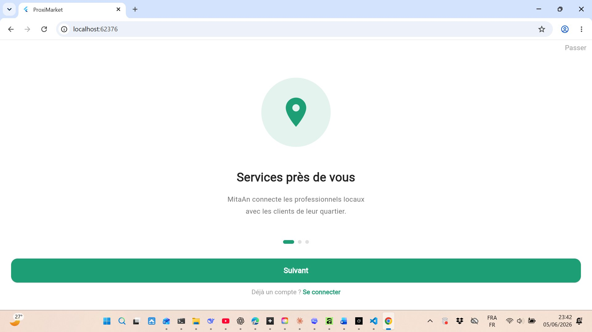 | 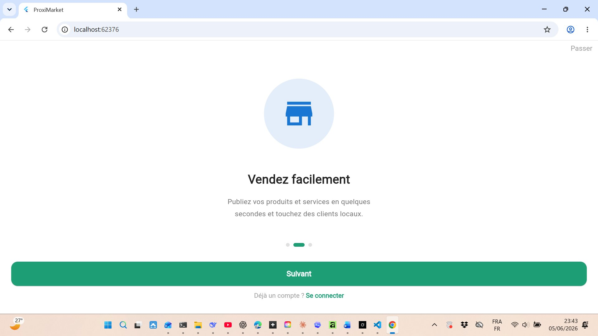 | 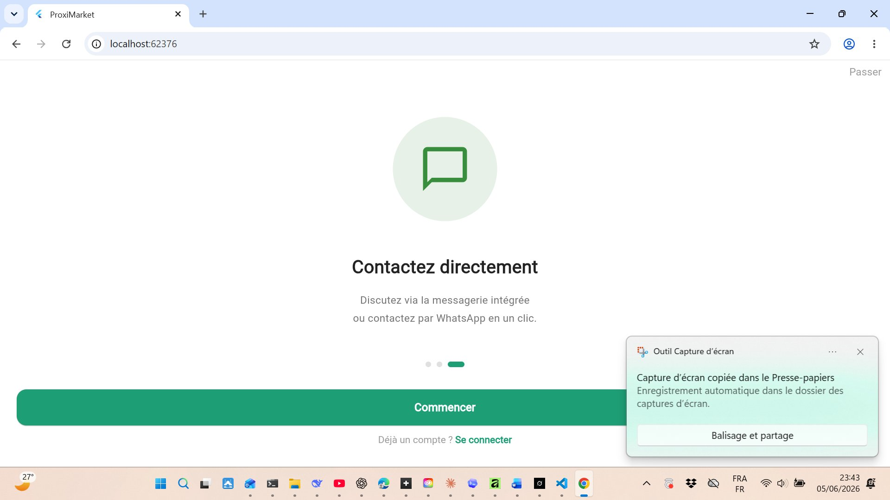 |
| *Splash animé gradient vert* | *Services près de vous* | *Vendez facilement* | *Contactez directement* |

</div>

<div align="center">

| Inscription |
|:---:|
| 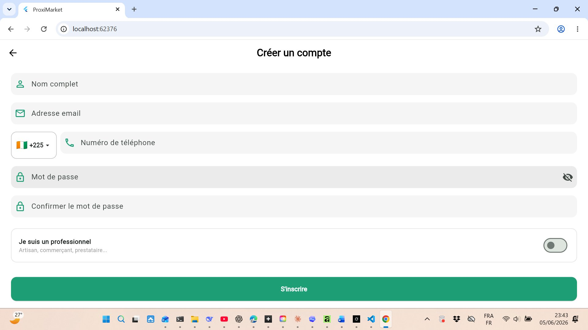 |
| *Formulaire avec sélecteur de pays, switch professionnel* |

</div>

---

### Navigation principale

<div align="center">

| Accueil | Carte OSM | Liste des annonces |
|:---:|:---:|:---:|
| 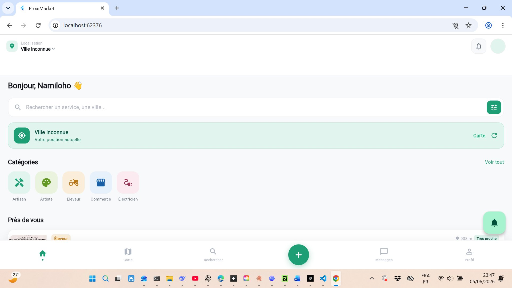 | 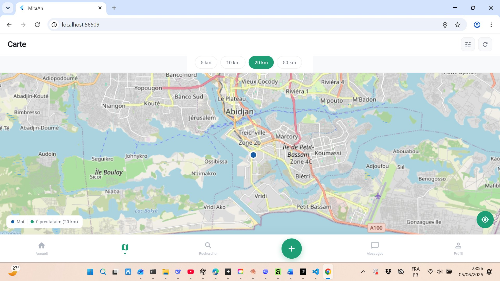 | 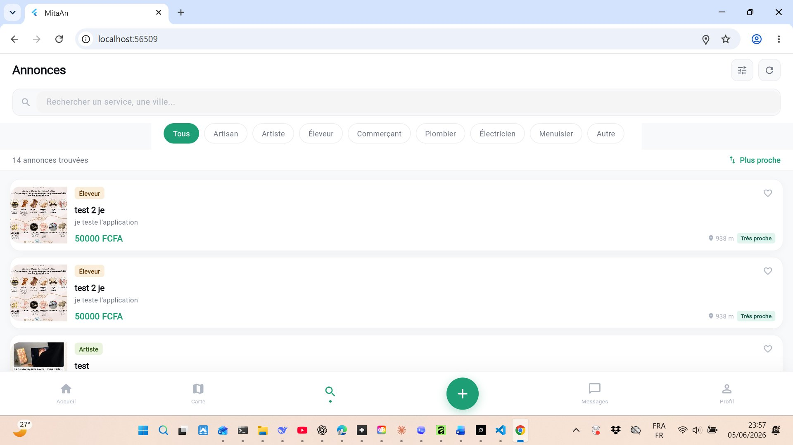 |
| *Feed GPS, catégories, annonces proches* | *Marqueurs pros, filtre rayon 20 km (Abidjan)* | *Recherche, filtres, tri, 14 annonces* |

</div>

---

### Publication & Communication

<div align="center">

| Publier une annonce | Messages |
|:---:|:---:|
| 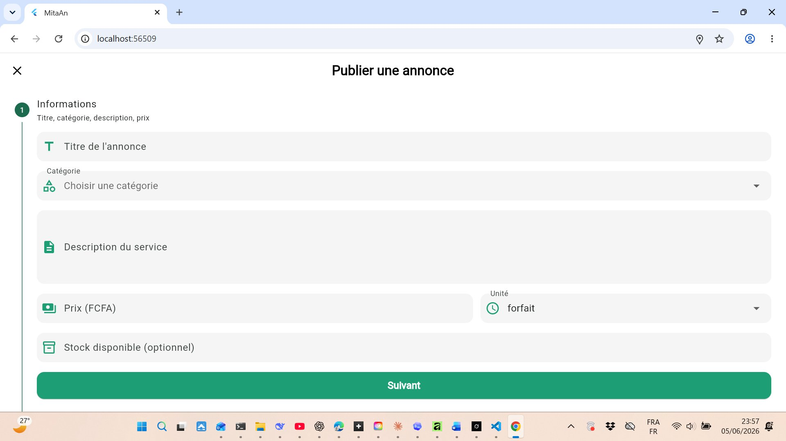 | 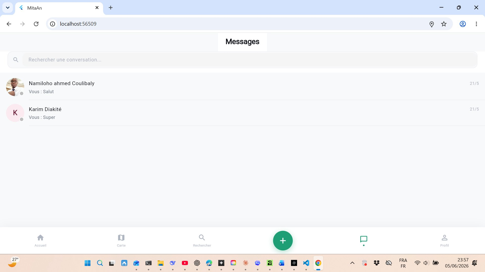 |
| *Stepper 3 étapes, titre/catégorie/prix/stock* | *Conversations temps réel avec badge non-lus* |

</div>

---

### Profil & Gestion

<div align="center">

| Mon profil | Mes annonces | Mes favoris | Modifier profil |
|:---:|:---:|:---:|:---:|
| 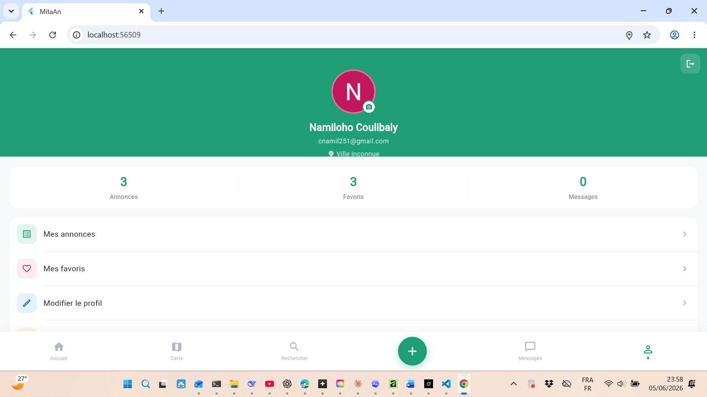 | 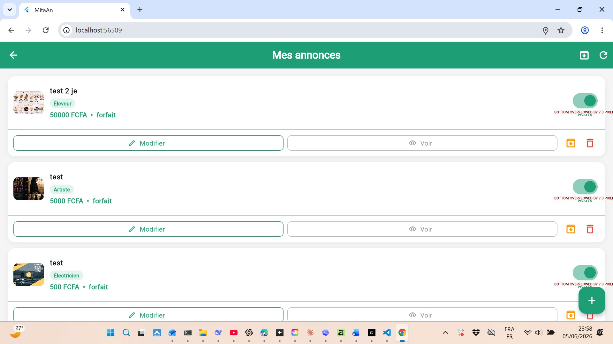 | 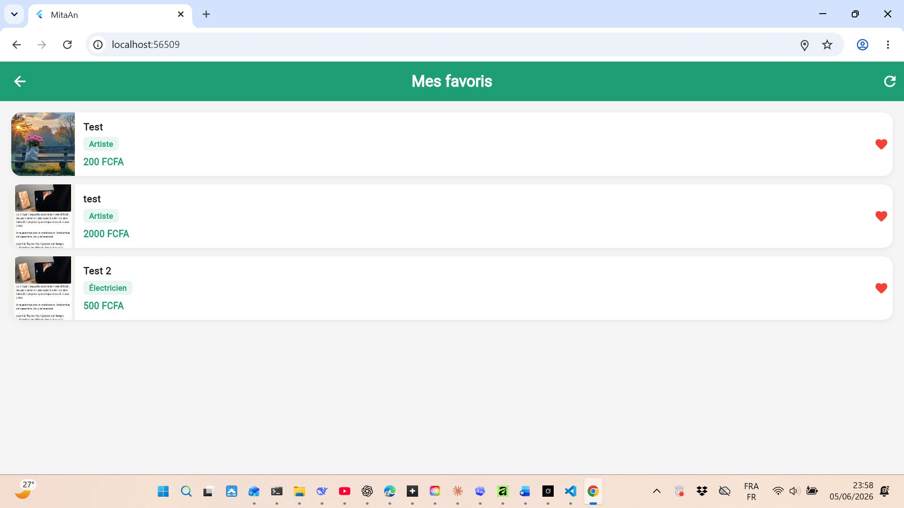 | 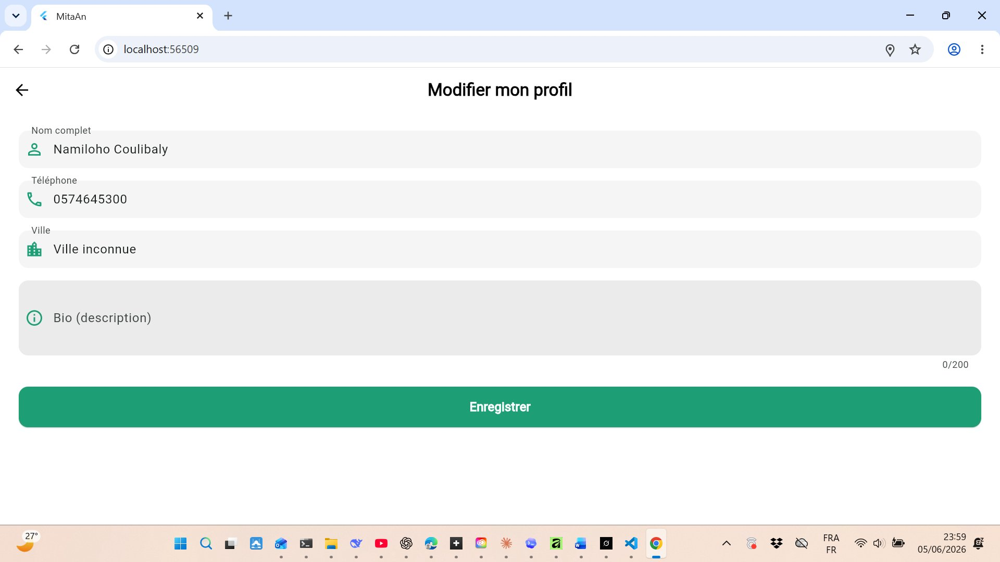 |
| *Stats temps réel, menu, avatar* | *Toggle actif, modifier, archiver* | *Favoris avec cœur rouge* | *Formulaire pré-rempli, ville GPS* |

</div>

---

## 📊 Stack Technique

### Packages Flutter

| Package | Version | Usage |
|---------|---------|-------|
| `firebase_core` | ^3.6.0 | Initialisation Firebase |
| `cloud_firestore` | ^5.4.0 | Base de données temps réel |
| `firebase_auth` | ^5.3.0 | Authentification |
| `firebase_messaging` | ^15.0.0 | Notifications push |
| `firebase_crashlytics` | ^4.0.0 | Crash reporting |
| `google_sign_in` | ^6.0.0 | Connexion Google |
| `provider` | ^6.0.0 | Gestion d'état |
| `image_picker` | ^1.0.0 | Sélection photos |
| `geolocator` | ^14.0.2 | Position GPS |
| `geocoding` | ^4.0.0 | Coordonnées → Ville |
| `flutter_map` | ^7.0.2 | Carte interactive OSM |
| `latlong2` | ^0.9.1 | Coordonnées GPS |
| `http` | ^1.6.0 | Upload Cloudinary |
| `shared_preferences` | ^2.3.2 | Stockage local |
| `connectivity_plus` | ^6.0.3 | Détection offline |
| `flutter_local_notifications` | ^17.0.0 | Notifications locales |
| `url_launcher` | ^6.3.2 | Appel + WhatsApp |

### Collections Firestore

| Collection | Rôle |
|------------|------|
| `users` | Profils, GPS, favoris, FCM token, rating |
| `services` | Annonces avec photos, GPS, stock, catégorie |
| `chats/{id}/messages` | Messages temps réel |
| `chats` | Métadonnées conversations (lastMessage, unread) |
| `reviews` | Avis et notes des prestataires |
| `reports` | Signalements de profils |
| `notifications_queue` | File d'attente notifications FCM |

---

## 🚀 Installation

### Prérequis

| Composant | Version | Requis |
|-----------|---------|--------|
| Flutter | 3.41.9+ | Obligatoire |
| Dart | 3.11.5+ | Inclus avec Flutter |
| Android Studio | Latest | Pour l'émulateur |
| Firebase CLI | Latest | Pour la config Firebase |
| Git | Latest | Obligatoire |

### Installation rapide

```bash
# 1. Cloner le projet
git clone https://github.com/VOTRE_ORG/mitan.git
cd mitan/proximarket_app

# 2. Installer les dépendances
flutter pub get

# 3. Configurer Firebase
# Placer google-services.json dans android/app/
# (fichier fourni par la console Firebase)

# 4. Générer les icônes et splash screen
flutter pub run flutter_launcher_icons
flutter pub run flutter_native_splash:create

# 5. Lancer l'application
flutter run

# 6. Builder un APK de test
flutter build apk --debug
```

### Build de production

```bash
# Vérifier que key.properties est configuré dans android/
# (storeFile, storePassword, keyAlias, keyPassword)

# Builder l'App Bundle pour le Play Store
flutter build appbundle --release

# Output : build/app/outputs/bundle/release/app-release.aab
```

### Commandes utiles

```bash
flutter clean                          # Nettoyer le cache
.\gradlew.bat clean                    # Nettoyer Gradle (Windows)
flutter run -d 15870705CJ002776        # Run sur Infinix X6525D
flutter build apk --release            # APK signé
flutter build appbundle --release      # AAB pour Play Store
```

### ⚠️ Fichiers à NE PAS committer

```bash
# Vérifier votre .gitignore — ces fichiers doivent être exclus :
android/app/google-services.json
android/key.properties
*.jks
.env
ios/GoogleService-Info.plist
```

---

## 🗺️ Roadmap

| Version | Statut | Contenu |
|---------|--------|---------|
| **V1 — MVP** | ✅ Quasi-complet | Inscription, GPS, annonces, recherche, chat, notifications, reviews |
| **V2 — Marketplace** | ⏳ Planifié | Produits physiques, gestion stock avancée, commandes |
| **V3 — Communication** | ⏳ Planifié | Amélioration messagerie, demandes de service, statuts |
| **V4 — Paiement** | 🔮 Futur | Mobile Money, carte bancaire, commission plateforme |
| **V5 — Monétisation** | 🔮 Futur | Annonces sponsorisées, comptes premium, boost visibilité |
| **V6 — GPS avancé** | 🔮 Futur | Navigation GPS, suivi livraison, estimation de temps |

---

## 🌍 Vision

MitaAn vise à devenir **la référence du commerce local numérique en Afrique de l'Ouest** :

```
Phase 1 (actuelle)  →  MVP fonctionnel — Abidjan, Côte d'Ivoire
Phase 2             →  Expansion nationale CI + marketplace produits
Phase 3             →  Mali, Sénégal, Burkina Faso, Guinée, Ghana, Nigeria
Phase 4             →  Paiement Mobile Money (Orange Money, Wave, MTN)
Phase 5             →  Monétisation : premium, pub sponsorisée, commission
```

> **Objectif final : devenir la plateforme de référence du commerce local et des services numériques en Afrique de l'Ouest.**

---

## 👥 Équipe

| Rôle | Membre | Responsabilités |
|------|--------|----------------|
| **Collaborateur 1 — Backend** | COULIBALY Ahmed Namiloho Aziz | Firebase, Firestore, Auth, modèles de données, services, règles de sécurité, architecture |
| **Collaborateur 2 — Frontend** | *(Collaborateur)* | Écrans Flutter, widgets, navigation, intégration packages, tests UX |

### Répartition technique

```
Backend (Namil)                    Frontend (Collaborateur)
──────────────────────────────     ──────────────────────────────
✅ Firebase / Firestore            ✅ Écrans Flutter (UI/UX)
✅ Firebase Auth + Google          ✅ Widgets & composants visuels
✅ Cloudinary (images)             ✅ Navigation & routing
✅ FCM Notifications               ✅ Intégration packages
✅ Règles de sécurité              ✅ Tests utilisateurs & UX
✅ Indexes composites              ✅ Responsive design
✅ Models & Providers              ✅ Animations & transitions
✅ Architecture générale
```

---

## 📄 Informations techniques

```yaml
Nom de l'app       : MitaAn
Package name       : com.mitan.app
Firebase project   : mitaan-fea0b
Couleur primaire   : #1D9E75 (vert)
Flutter version    : 3.41.9
Dart version       : 3.11.5
Appareil de test   : Infinix X6525D (Android 14)
Target             : Android (Google Play Store)
État               : Version 1.0.0-beta
```

---

<div align="center">

**MitaAn** — *Trouvez tout près de vous*

[](https://flutter.dev)
[](https://firebase.google.com)
[](https://openstreetmap.org)

*Abidjan, Côte d'Ivoire — 2025/2026*

</div>